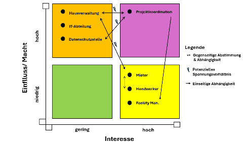

Die folgende Stakeholder-Matrix ordnet die identifizierten Stakeholder entlang der Dimensionen Interesse und Einfluss/Macht ein. Sie dient dazu, relevante Akteure zu priorisieren und geeignete Strategien für Einbindung, Kommunikation und Steuerung im Projektverlauf abzuleiten.

