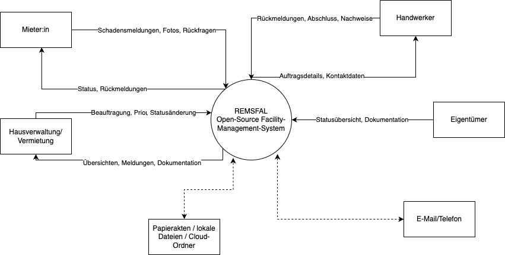

|  |  |  |  |
| --- | --- | --- | --- |
| **Systemname** | **Systemtyp** | **Systembeschreibung** | **Rolle im Gesamtkontext** |
| REMSFAL | Zentrales Anwendungssystem | remsfal ist eine webbasierte, offene Plattform zur digitalen Unterstützung von Immobilien- und Instandhaltungsprozessen. Das System ermöglicht die strukturierte Erfassung von Schadensmeldungen, die zentrale Dokumentation relevanter Informationen (z. B. Beschreibungen, Fotos, Status) sowie die transparente Nachverfolgung von Vorgängen. Es dient als gemeinsame Arbeitsgrundlage für Mieter:innen, Hausverwaltungen, Eigentümer:innen und Handwerker:innen. | Hauptsystem – Gegenstand der Entwicklung und der Anforderungsanalyse |
| E-Mail / Telefon | Externe Kommunikationssysteme | E-Mail und Telefon werden aktuell häufig zur Abstimmung zwischen den Beteiligten genutzt. Die Kommunikation erfolgt dabei unstrukturiert, verteilt über mehrere Kanäle und ohne zentrale Dokumentation. Diese Systeme sind technisch unabhängig von remsfal und führen häufig zu Medienbrüchen, Informationsverlusten und fehlender Nachvollziehbarkeit. | Kontextsystem – beeinflusst Prozesse, ist aber nicht Teil des Systems |
| Externe Dokumentationssysteme(Papierakten, lokale Dateien) | Externe Ablagesysteme | Informationen zu Schäden, Reparaturen oder Absprachen werden häufig in dezentralen Ablagen gespeichert. Diese Systeme sind nicht miteinander verknüpft, schwer zugänglich und oft nicht für alle Beteiligten sichtbar. Sie stellen eine zentrale Ursache für Intransparenz und Doppelarbeit dar. | Kontextsystem – bestehende Alternativen zur Systemnutzung |
| IT-Infrastruktur(Server, Datenbanken, Hosting) | Technisches Basissystem | Die technische Infrastruktur stellt den Betrieb von remsfal sicher, z. B. durch Hosting, Datenspeicherung und Zugriffssicherheit. Sie beeinflusst Aspekte wie Verfügbarkeit, Performance und Datenschutz, ist jedoch nicht Teil der fachlichen Systemlogik. | Unterstützendes System – technische Voraussetzung |
| Regulatorisches Umfeld(z. B. DSGVO) | Rahmenbedingung / Einflussfaktor | Gesetzliche und regulatorische Vorgaben bestimmen, wie Daten erfasst, gespeichert und verarbeitet werden dürfen. Diese Vorgaben wirken indirekt auf Systemanforderungen (z. B. Datenschutz, Zugriffskontrollen), stellen jedoch selbst kein technisches System dar. | Einflussfaktor – begrenzt und steuert die Systemgestaltung |

