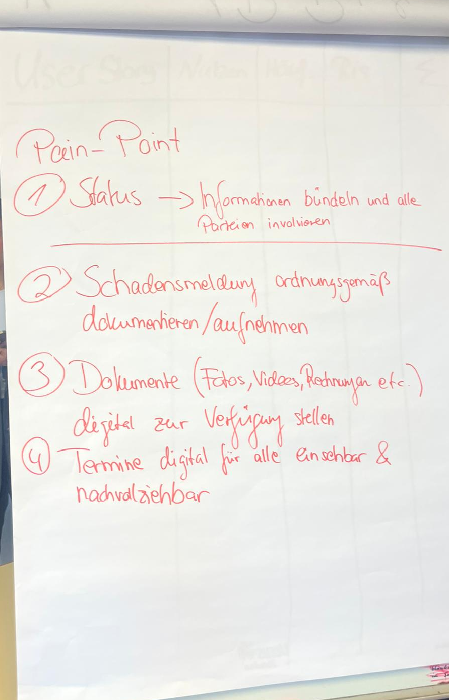
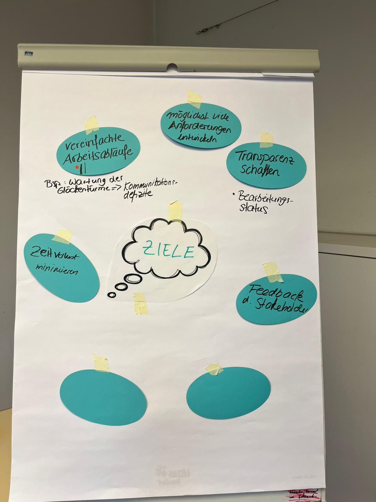
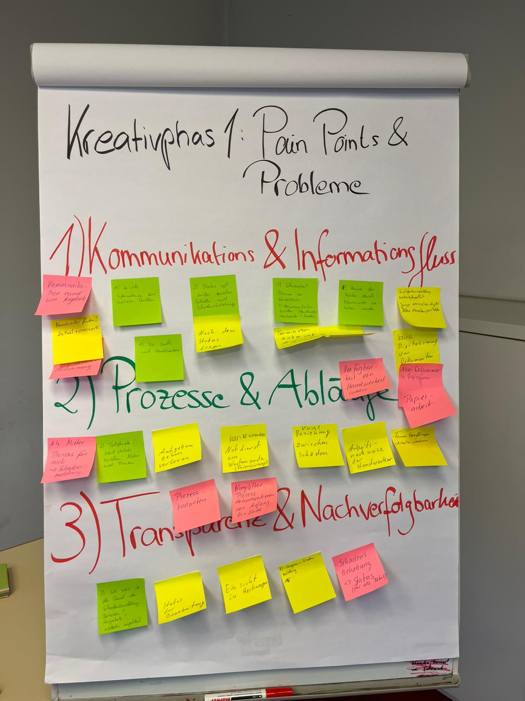
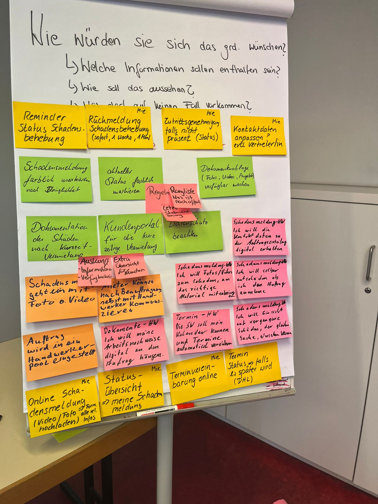
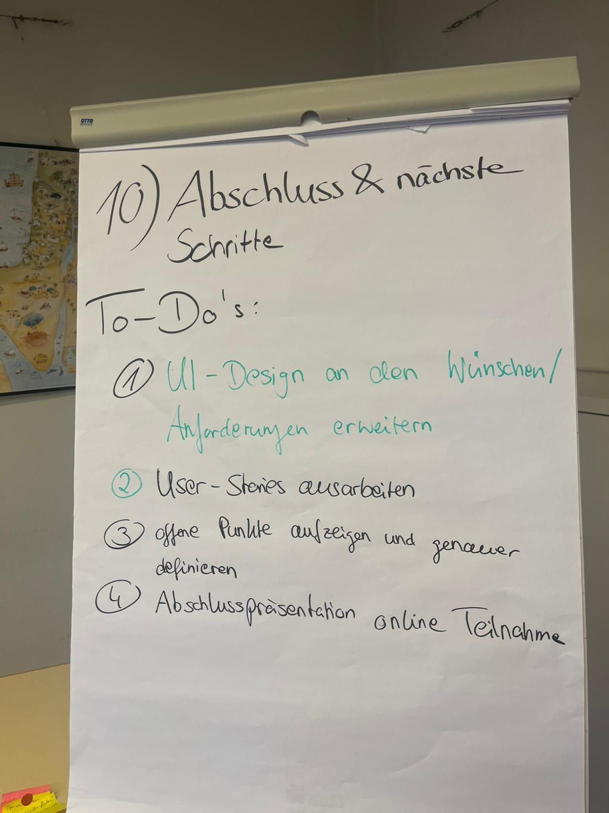

|  |  |  |  |  |  |  |
| --- | --- | --- | --- | --- | --- | --- |
| **Phase** | **Zeit** | **Programmpunkt** | **Ziel / Inhalt** | **Methode / Ergebnis** | **Steps** | **Material** |
| **Phase 1** | 0:00 – 0:10 (10 min) | Begrüßung & Einstieg | Vorstellung des Projekts remsfal sowie der Ziele des Workshops. Gemeinsames Verständnis für den Anlass und den Nutzen des Workshops schaffen. | Kurze Präsentation mit Folien (Projektüberblick und Workshop-Ziele). Erwartungen der Stakeholder werden aktiv abgefragt und auf einem Flipchart (o.ä) gesammelt. | Folien - Begrüßungsfolien - Agenda - Warum sind wir hier und was wollen wir erreichen?  moderationsleitfaden: Begrüßung aller Teilnehmenden. Vorstellung der Agenda und des Projektkontexts. Abfrage der Erwartungen („Was wünschen Sie sich vom heutigen Workshop?“). Dokumentation der Erwartungen auf Flipchart. | Beamer, Flipchart, Marker |
| **Phase 2** | 0:10 – 0:20 (10 min) | Vorstellungsrunde | Die Rollen, Verantwortlichkeiten und Arbeitskontexte der Stakeholder verstehen. | Allgemeine Vorstellung der Teilnehmenden Zusätzlich erklären die Teilnehmenden in ca. 2 Minuten, wie sie aktuell mit Schadensmeldungen umgehen. | 1. Moderator beginnt mit einer kurzen Selbstvorstellung. 2. Jede Person beschreibt ihren aktuellen Prozess zur Schadensbearbeitung. 3. Protokoll erfasst typische Abläufe und Unterschiede. | Namensschilder |
| **Phase 3** | 0:20 – 0:30 (10 min) | Zielsetzung definieren | Klärung der Workshopziele aus Sicht der Stakeholder und Abgleich mit den Workshopzielen des Projektteams. Gemeinsame Erwartungsabfrage: „Was wünschen Sie sich vom Workshop?“ | Moderierte Runde, in der Erwartungen und Ziele gesammelt werden. Gemeinsame Zieldefinition wird schriftlich festgehalten. | 1. Frage an alle: „Was möchten Sie unbedingt aus dem Workshop mitnehmen?“ 2. Gemeinsame Formulierung der Ziele (z. B. Transparenz schaffen, Anforderungen erfassen). 3. Dokumentation auf Flipchart. | Flipchart |
| **Phase 4** | 0:30 - 0:35 (5min) | Gemeinsamer Arbeitskontext / Scope definieren (5–7 Minuten) | Sicherstellen, dass alle Stakeholder über denselben Prozess sprechen. Festlegen, welcher Abschnitt des Facility-Management-Prozesses betrachtet wird (z. B. Schadensmeldung bis Behebung). | Kurze Visualisierung eines einfachen Prozessflusses. Stakeholder ergänzen oder korrigieren. | 1. Groben Prozessverlauf aufzeichnen. 2. Stakeholder fragen, ob dieser Ablauf ihre Realität widerspiegelt. 3. Gemeinsamen Scope bestätigen. |  |
| **Phase 5** | 0:35 – 1:00 (25 min) | Kreativphase 1: Pain Points & Probleme | Identifikation von bestehenden Problemen, Engpässen und ineffizienten Arbeitsabläufen. Welche Probleme nerven im Alltag? Was kostet Zeit, Geld, Nerven? | Post-it-Brainstorming „Was nervt, kostet Zeit oder Geld?“ - gemeinsam an einer Pinnwand. Teilnehmende sammeln individuelle Pain Points. Anschließend strukturiertes Clustering nach Kategorien (z. B. Kommunikation, Dokumentation, Prozesse). | 1. Brainstorming: Jede Person schreibt Probleme auf einzelne Post-its (5 Minuten). 2.Post-its werden an Pinnwand angebracht. 3. Jede Person erläutert ihre Punkte kurz. 4. Gemeinsames Clustering nach Themenbereich. 5. Zusammenfassung der Hauptprobleme durch Moderation. | Post-its, Moderationskoffer |
| **Phase 6** | 1:00 – 1:20 (20 min) | Fokus finden: Welche Themen sind am wichtigsten? | Priorisierung der relevanten Themen. | Dot-Voting (jeder 3 Punkte). | 1. Dot-Voting erklären. 2. Stakeholder setzen ihre drei Punkte frei verteilt. 3. Ergebnisse sichtbar zusammenfassen (Top Pain Points). | Klebepunkte |
|  | 1:20 – 1:30 (10 min) | Pause | — | — |  | Getränke |
| **Phase 7** | 1:30 – 2:00 (30 min) | Kreativphase 2: Ideen zur Digitalisierung (To-Be) | Ideen sammeln, wie remsfal die priorisierten Probleme lösen kann. Fokus auf digitalisierbare Abläufe. Was könnte remsfal besser machen? Welche Abläufe sollten digital laufen? | Offene Diskussion, geleitet durch die Pain Points. Kategorien für Lösungsvorschläge entstehen: Schadensmeldung, Statusverfolgung, Handwerkerkommunikation, Dokumentation. „Wie würde remsfal das ideal lösen?“ / „Was soll das System tun?“ / „Welche Abläufe sollte remsfal digital unterstützen?“ | 1. Vorstellung der Top-Pain Points. 2. Leitfragen stellen („Wie würde ein idealer digitaler Ablauf aussehen?“). 3. Ideen direkt neben die Pain Points schreiben. 4. Zusammenfassung in Themenkategorien. | Miro/Flipchart |
| **Phase 8** | 2:00 – 2:30 (30 min) | Funktionale Anforderungen & User Stories | Erstellung erster nutzerzentrierter Anforderungen in Form von User Stories mit passenden Akzeptanzkriterien. | Formulierung von User Stories der Struktur „Als [Rolle] möchte ich [Ziel], um [Nutzen].“. Anschließende Sammlung und Priorisierung. | 1. Erklärung der User-Story-Struktur. 2. Stakeholder schreiben 3–5 Stories. 3. Sammlung und Sortierung an der Pinnwand. 4. Priorisierung der wichtigsten Stories. | User-Story-Vorlagen |
| **Phase 9** | 2:30 – 2:50 (20 min) | UI-Vorschau & Validierung | Stakeholder erhalten eine erste visuelle Vorstellung von möglichen Systemoberflächen. | Vorstellung vorbereiteter Figma-Screens. Diskussion und Feedbackrunde. Ableitung konkreter UI-Anforderungen. | 1. Screens zeigen (z. B. Schadensmeldung, Dashboard). 2. Leitfragen stellen („Fehlt etwas?“, „Würden Sie damit arbeiten?“). 3. Feedback strukturiert erfassen. | Figma, Beamer |
| **Phase 10** | 2:50 – 3:00 (10 min) | Abschluss & nächste Schritte | Ergebnisse sichern, To-Dos definieren und nächstes Vorgehen abstimmen. | Fotos/Miro-Export → Wiki-Eintrag. Verantwortliche benennen. |  | Handy / Laptop |

**Dokumentation des Anforderungsworkshops zum Projekt REMSFAL**

**1. Einordnung und Zielsetzung des Workshops**

Im Rahmen des Projekts REMSFAL haben wir am Freitag, den 28. November 2025, einen Anforderungsworkshop durchgeführt. Ziel des Workshops war es, gemeinsam mit relevanten Stakeholdern die bestehenden Abläufe im Schadensmanagement zu analysieren, zentrale Herausforderungen zu identifizieren und erste Anforderungen für die digitale Weiterentwicklung von REMSFAL zu formulieren.

Mit REMSFAL verfolgen wir das Ziel, ein nutzerzentriertes und zukunftsorientiertes System für das Gebäudemanagement zu entwickeln. Da die beteiligten Akteure aus unterschiedlichen organisatorischen und fachlichen Kontexten stammen, war es uns wichtig, frühzeitig ein gemeinsames Verständnis für bestehende Probleme, Bedürfnisse und Erwartungen zu schaffen. Der Workshop stellte einen zentralen Bestandteil der Anforderungsanalyse dar und bildete die Grundlage für die weitere konzeptionelle Ausarbeitung des Systems.

**2. Rahmenbedingungen und Teilnehmende**

Der Workshop fand von 11:00 bis 14:00 Uhr in den Räumlichkeiten der katholischen Pfarrgemeinde Maria Gnaden in Berlin Hermsdorf statt. Die gewählte Umgebung ermöglichte eine konzentrierte Arbeitsatmosphäre und unterstützte einen offenen und konstruktiven Austausch zwischen allen Beteiligten.

Am Workshop nahmen verschiedene Stakeholder teil, die direkt in das Schadensmanagement und die Immobilienverwaltung eingebunden sind oder als Projektpartner agieren. Vertreten waren Jan Gehring von der Hausverwaltung Gehring, Jeanette Stanik als Pfarrsekretärin und Vertreterin der Immobilienverwaltung des Erzbistums Berlin, Marcus Sklorz als Vertreter eines Handwerksbetriebs im Bereich SHK sowie Alexander Stanik als Projektpartner mit organisatorischer Koordinationsfunktion.

Die Moderation des Workshops wurde von Eshmam Dulal, Ranya Cherara und Jenin Abdul Hamid übernommen. Verena Majuntke war als unterstützende Person anwesend und nahm im Workshop die Rolle einer Mieterin ein. Durch diese Perspektive konnten nutzerbezogene Anforderungen aus Sicht der späteren Anwender gezielt in die Diskussion eingebracht werden.

**3. Ablauf und Vorgehensweise**

Zu Beginn des Workshops begrüßten wir die Teilnehmenden und stellten das Projekt REMSFAL sowie die Zielsetzung des Workshops vor. Zudem erläuterten wir den geplanten Ablauf und die einzelnen Arbeitsphasen, um eine gemeinsame Orientierung zu schaffen.

In der ersten inhaltlichen Phase analysierten wir gemeinsam den aktuellen Ist Zustand des Schadensmanagements. Die Stakeholder schilderten ihre bisherigen Vorgehensweisen bei der Schadenmeldung, Bearbeitung und Dokumentation. Dabei wurden insbesondere fehlende Transparenz, Medienbrüche zwischen verschiedenen Kommunikationskanälen sowie ein hoher manueller Koordinationsaufwand deutlich. Diese Phase diente dazu, zentrale Problemstellen sichtbar zu machen und ein gemeinsames Verständnis der bestehenden Abläufe zu entwickeln.

In der anschließenden Phase sammelten wir die identifizierten Herausforderungen und diskutierten diese im Plenum. Die Teilnehmenden beschrieben, welche Aspekte aus ihrer Sicht besonders problematisch sind und wo der größte Handlungsbedarf besteht. Auf dieser Grundlage erarbeiteten wir erste Lösungsansätze und Ideen für eine digitale Unterstützung der Prozesse.

In der letzten Phase des Workshops formulierten wir gemeinsam erste Anforderungen an ein zukünftiges System. Dabei berücksichtigten wir sowohl funktionale als auch organisatorische und qualitative Anforderungen. Die Ergebnisse wurden strukturiert zusammengefasst und gemeinsam reflektiert.

**4. Zentrale Ergebnisse und Anforderungen**

Ein zentrales Ergebnis des Workshops ist der übereinstimmende Bedarf an einer zentralen digitalen Plattform für das Schadensmanagement. REMSFAL soll als gemeinsame Informationsbasis dienen, auf die alle relevanten Akteure zugreifen können, um Informationen gebündelt und nachvollziehbar bereitzustellen.

Funktional wurde insbesondere der Wunsch nach einer strukturierten und einheitlichen Schadenserfassung deutlich. Schäden sollen einfach gemeldet, eindeutig zugeordnet und über den gesamten Bearbeitungsprozess hinweg dokumentiert werden können. Zudem besteht der Bedarf an einer transparenten Übersicht über den aktuellen Bearbeitungsstand sowie über Zuständigkeiten und beteiligte Dienstleister.

Auf organisatorischer Ebene zeigte sich die Notwendigkeit einer klaren Rollen und Rechteverteilung innerhalb des Systems. Unterschiedliche Nutzergruppen benötigen unterschiedliche Zugriffsrechte, gleichzeitig soll der Informationsfluss für alle Beteiligten nachvollziehbar bleiben. Eine lückenlose Dokumentation von Bearbeitungsschritten und Entscheidungen wurde als wesentlich angesehen.

Qualitativ legten wir großen Wert auf eine intuitive und benutzerfreundliche Gestaltung des Systems. REMSFAL soll ohne lange Einarbeitungszeit nutzbar sein und sich an den realen Arbeitsabläufen der Nutzer orientieren. Übersichtlichkeit, klare Strukturen und eine verständliche Darstellung der Informationen wurden als zentrale Qualitätsmerkmale definiert.

**5. Bewertung des Workshops**

Aus unserer Sicht stellte der Anforderungsworkshop einen wichtigen und erfolgreichen Schritt im Projekt REMSFAL dar. Der direkte Austausch zwischen den unterschiedlichen Stakeholdern ermöglichte es uns, bestehende Probleme offen zu benennen und gemeinsam zu reflektieren.

Besonders positiv bewerten wir, dass neben funktionalen Anforderungen auch organisatorische sowie nutzerbezogene Perspektiven berücksichtigt wurden. Die Einbindung der Mieterperspektive trug dazu bei, das System nicht nur aus Sicht der Verwaltung und Dienstleister, sondern auch aus Anwendersicht zu betrachten. Gleichzeitig wurde deutlich, dass einzelne Anforderungen in den nächsten Projektphasen weiter konkretisiert und priorisiert werden müssen.

**6. Fazit und Ausblick**

Zusammenfassend halten wir fest, dass der Anforderungsworkshop eine tragfähige Grundlage für die weitere Entwicklung von REMSFAL geschaffen hat. Die gemeinsam erarbeiteten Erkenntnisse und Anforderungen bilden die Basis für die Erstellung eines strukturierten Anforderungskatalogs.

In den nächsten Schritten werden wir die Ergebnisse weiter ausarbeiten, priorisieren und in konkrete fachliche und technische Konzepte überführen. Auf dieser Grundlage können erste Lösungsansätze entwickelt und in weiteren Abstimmungsrunden gemeinsam mit den Stakeholdern überprüft und verfeinert werden.

  
  

​

