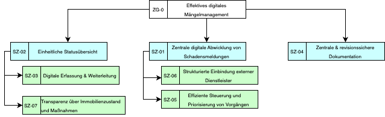

```

```

|  |  |  |
| --- | --- | --- |
| Ziel-ID | Systemziel | Zielbeschreibung |
| SZ-01 | Zentrale digitale Abwicklung von Schadensmeldungen | Das System soll den gesamten Prozess von der Schadensmeldung bis zum Abschluss digital, medienbruchfrei und zentral unterstützen. |
| SZ-02 | Einheitliche Status- und Prozess­transparenz | Das System soll allen berechtigten Beteiligten eine jederzeit nachvollziehbare, einheitliche Statusübersicht über Vorgänge ermöglichen. |
| SZ-03 | Reduktion manueller Kommunikation und Koordination | Das System soll Rückfragen, Abstimmungen und Mehrfacheingaben durch strukturierte Informationen und automatisierte Prozessschritte reduzieren. |
| SZ-04 | Vollständige und revisionssichere Dokumentation | Das System soll alle relevanten Informationen, Dokumente und Statusänderungen eines Vorgangs vollständig, versioniert und nachvollziehbar speichern. |
| SZ-05 | Effiziente Steuerung und Priorisierung von Vorgängen | Das System soll die Priorisierung, Eskalation und gezielte Bearbeitung von Vorgängen nach definierten Kriterien unterstützen. |
| SZ-06 | Strukturierte Einbindung externer Dienstleister | Das System soll die digitale Einbindung von Handwerker:innen in den Prozess ermöglichen, inklusive Auftragszuweisung, Rückmeldung und Dokumentation. |
| SZ-07 | Transparenz über Immobilienzustand und Maßnahmen | Das System soll einen übergreifenden Überblick über Schäden, Maßnahmen und Bearbeitungsstände je Immobilie ermöglichen. |

